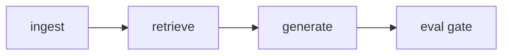

# RAG Reliability Harness

Offline-first RAG eval gate: catch stale context, bad ranking, and unsupported answers in CI — no API keys required.


## Flow



Corpus → chunk/embed → top-k retrieve → extractive answer (or refuse) → metrics vs golden set + baseline. Gate fails the build on regression.

## Before / after (synthetic, reproducible)

Injected regressions on a public FastAPI-style fixture corpus (no company data). Reproduce with `make simulate`.

| Failure mode | Blind path (before) | Full gate (after) |
|---|---|---|
| stale-context | 0% catch | 100% catch |
| ambiguous-ranking | 0% catch | 100% catch |
| unsupported-answer | 0% catch | 100% catch |

## 3 failure modes this harness catches

### 1. stale-context

**Example:** Index still has `mutable/v1` (`default_request_timeout_seconds = 30`) while gold expects `v2` (`60`). Answers look fluent but cite a stale truth; corpus fingerprint no longer matches.

**Caught by:** `tests/test_simulate.py::test_stale_context_sim_caught` and `make simulate` (`run_stale_scenario` → `drift_ok=False` → gate fail).

### 2. ambiguous-ranking

**Example:** Question about the HTTP *request* timeout competes with connection-pool / idle-deadline distractors. If ranking flips, MRR and precision slip even when the right chunk is somewhere in the top-k.

**Caught by:** `tests/test_simulate.py::test_ambiguous_ranking_sim_caught` and `make simulate` (`run_ambiguous_scenario` reverses hit order → gate fail).

### 3. unsupported-answer

**Example:** “What is the list price of Acme Cloud Enterprise?” — not in the corpus. Gold expects `INSUFFICIENT_CONTEXT`. A generator that always answers invents unsupported text.

**Caught by:** `tests/test_simulate.py::test_unsupported_always_answer_caught` and `make simulate` (`force_answer=True` → `refusal_accuracy` drop → gate fail).

## CI


GitHub Actions runs the offline eval suite on every push and pull request: `pytest` → ingest (`mutable/v2`) → `python -m eval` → `python -m gates`. No secrets. Replace `YOUR_GITHUB_USER` in the badge URL after you push the remote.

## Quickstart

```bash
python -m venv .venv && source .venv/bin/activate
pip install -e ".[dev]"
make all
```

Useful targets: `make test`, `make ingest`, `make eval`, `make gate`, `make simulate`.

## Attribution & optional adapters

- FastAPI-style docs under `data/corpus/fastapi/` are original paraphrases — see [`data/ATTRIBUTION.md`](data/ATTRIBUTION.md).
- **Optional pgvector:** `docker compose up -d`, set `DATABASE_URL` / `PGVECTOR_DSN` (see `.env.example`). Adapter raises `NotConfiguredError` without a DSN; CI uses the in-memory store.
- **Optional Langfuse:** set `LANGFUSE_PUBLIC_KEY` + `LANGFUSE_SECRET_KEY`. Without keys the tracer no-ops and records local spans only.
